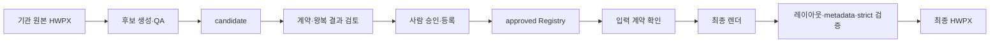

# HWPX 템플릿 생성·렌더링 엔진

기관 HWPX 원본을 재사용 가능한 템플릿 후보로 만들고, 사람이 승인한 템플릿에 값을
채워 최종 HWPX를 생성합니다. 자유 형식 문서 생성기나 포맷 변환기는 아닙니다.

## 먼저 알아야 할 상태 구분

| 상태 | 의미 | 가능한 작업 | 최종 문서 생성 |
|---|---|---|---|
| `candidate` | 자동 추출·왕복 QA가 끝난 검토 대상 | field·별칭·반복·metadata 계약 검토 | 불가 |
| `approved` | 사람이 계약과 결과를 확인해 승인한 운영 템플릿 | Registry 조회·입력 검사·최종 렌더 | 가능 |

후보 생성 성공이나 strict 검증 통과만으로 `approved`가 되지 않습니다. 운영
`TemplateRegistry`는 `approved`만 조회하며, 코드가 스스로 후보를 승인하지 않습니다.

현재 체크아웃된 비공개 템플릿 데이터 기준 상태는 다음과 같습니다.

| 문서 유형 | `template_id` | 상태 |
|---|---|---|
| 금감원 원장보고 | `fss_director_report` | `approved` |
| 금감원 원페이지 | `fss_one_page` | `approved` |
| 금감원 원장보고 가상자산 이상거래 | `fss_virtual_asset_report` | `candidate` |

## 작업 흐름



- 새 원본으로 템플릿을 만들려면 아래 1~4단계를 순서대로 진행합니다.
- 이미 승인된 원장보고·원페이지를 사용하려면 환경 준비 후 5단계로 바로 이동합니다.
- Python 코드에 연결하려면 6단계의 공개 API를 사용합니다.

반복 구간은 자동으로 의미를 추측하지 않습니다. 사람이 `alias_map.json`의 `blocks`로
선언한 구간만 입력 항목 수만큼 반복하며, 반복 계약이 없으면 각 위치를 독립 필드로
렌더합니다.

## 1. 실행 환경 준비

Python은 [.python-version](.python-version)의 3.13으로 고정합니다. 비공개
`templates/institutions/` 저장소를 읽을 권한이 있는 환경에서 submodule과 개발 의존성을
준비합니다.

Windows PowerShell:

```powershell
git submodule update --init --recursive
python -m venv .venv
.\.venv\Scripts\python.exe -m pip install -r requirements-dev.txt
```

macOS/Linux Bash:

```bash
git submodule update --init --recursive
python3 -m venv .venv
./.venv/bin/python -m pip install -r requirements-dev.txt
```

## 2. 새 원본 HWPX에서 후보 만들기

임의의 정상 HWPX는 아래 명령으로 `candidate` 템플릿을 만들 수 있습니다. 출력 폴더는
기존 경로를 덮어쓰지 않으며 `sandbox/` 아래의 새 경로를 사용합니다.

Windows PowerShell:

```powershell
.\.venv\Scripts\python.exe scripts/templates/qa_hwpx_template.py `
  --source <원본.hwpx> `
  --output-dir sandbox/template-candidates/<새-후보> `
  --institution <기관명> `
  --document-type <문서유형>
```

macOS/Linux Bash:

```bash
./.venv/bin/python scripts/templates/qa_hwpx_template.py \
  --source <원본.hwpx> \
  --output-dir sandbox/template-candidates/<새-후보> \
  --institution <기관명> \
  --document-type <문서유형>
```

이 명령은 원본 패키지 보존, 고정 문구와 교체 필드의 구조적 분류,
`placeholder_map.json`·`content.sample.json` 생성, sample/test 왕복 렌더와 strict
검증까지 자동으로 수행합니다. 결과는 승인 템플릿이 아니라 사람이 검토해야 하는
`candidate`입니다.

## 3. 후보 계약 검토

QA 명령이 성공하면 후보 폴더에서 아래 항목을 함께 검토합니다.

| 파일 | 확인할 내용 |
|---|---|
| `source.hwpx` | 입력 원본과 동일한 snapshot인지 |
| `template.json` | 기관·문서유형·`template_id`와 `status: candidate` |
| `placeholder_map.json` | field 위치, `replacement_mode`, 레이아웃 계약 |
| `template.review.md` | 자동 분류 결과를 사람이 승인할 수 있는지 |
| `content.sample.json`, `content.test.json` | 모든 field가 의도한 값을 받는지 |
| `roundtrip.sample.hwpx`, `roundtrip.test.hwpx` | 원본 구조와 서식이 보존되는지 |
| `qa.report.json` | source snapshot, field identity, strict 검증 결과 |
| `alias_map.json` | 별칭·choice·text rule·반복·metadata 계약. 최종 생성용 후보라면 사람이 작성 |

strict 검증 성공만으로 의미상 field 분류, 반복 구간, 기관 승인이 자동 확정되는 것은 아닙니다.
최종 문서 생성 경로는 `alias_map.json`의 metadata 계약과 요청자 정보도 요구합니다. 등록 CLI는
후보의 필수 파일·식별자·상태를 검사하지만 이 metadata 계약까지 대신 작성하거나 승인하지
않으므로, 최종 생성용 후보는 등록 전에 계약을 완성하고 왕복 결과를 다시 확인해야 합니다.

### 반복 계약을 정하는 기준

후보 생성기는 원본 바이트에서 확인되는 구조만 기록합니다. 어떤 문단이 의미상 반복되는지는
임의로 추측하지 않습니다.

- `alias_map.json`의 반복 블록 계약이 없으면 각 교체 위치를 독립 필드로 만든다.
- 사람이 반복 anchor·level·separator를 확인해 `alias_map.json`의 `blocks`로 선언하면,
  이후 렌더러가 입력 항목 수만큼 해당 원본 문단 구조를 반복 전개한다.
- 반복이 필요 없는 템플릿은 별도 반복 계약 없이 그대로 후보 생성·QA가 가능하다.

따라서 “아무 HWPX나 넣으면 안전한 비반복 후보가 만들어지는 경로”는 자동화되어 있지만,
“문서 의미를 읽어 반복 구간까지 자동 확정”하는 기능은 제공하지 않습니다. 이는 잘못된 반복
판단으로 기관 서식을 바꾸지 않기 위한 의도적인 경계입니다.

## 4. 승인 후보 등록

사람이 후보를 검토하고 승인한 경우에만 등록합니다.

Windows PowerShell:

```powershell
.\.venv\Scripts\python.exe scripts/templates/register_hwpx_template.py `
  --candidate sandbox/template-candidates/<후보> --approve
```

macOS/Linux Bash:

```bash
./.venv/bin/python scripts/templates/register_hwpx_template.py \
  --candidate sandbox/template-candidates/<후보> --approve
```

등록은 후보를 정식 Registry 경로에 복사해 `approved`로 바꾸고 Registry 조회를 확인한 뒤,
성공한 경우 원래 후보 폴더를 삭제합니다. 정식 경로는 비공개 `templates/institutions/`
submodule 내부이므로 등록 결과는 템플릿 데이터 저장소에서 별도로 검토·커밋해야 합니다.
이 명령은 Git commit이나 push를 자동으로 수행하지 않습니다.

## 5. 승인 템플릿으로 최종 문서 생성

승인 템플릿은 `template_id`와 metadata 계약을 가진 입력으로 렌더합니다.

`content.json`은 최상위에 `template_id`와 `fields` 두 키를 요구합니다(`load_template_content`).
`template_id`가 승인 템플릿의 값과 다르면 `template_id mismatch`로 렌더를 거부합니다.

```json
{
  "template_id": "<승인 템플릿의 template_id>",
  "fields": {
    "<사람용 별칭 또는 field_id>": "<값>"
  }
}
```

`fields`의 키로 무엇을 쓸 수 있는지는 그 템플릿의 `alias_map.json`이 정합니다. 최종 생성은
metadata 계약을 포함한 alias 계약의 사람용 이름을 사용합니다. `alias_map.json`이 아직 없는
후보의 QA 왕복에서만 `field_id`를 그대로 입력합니다.

Windows PowerShell:

```powershell
.\.venv\Scripts\python.exe scripts/templates/render_hwpx_template.py `
  --institution <기관명> --document-type <문서유형> `
  --content <content.json> --output sandbox/<출력.hwpx> `
  --requester-name <요청자>
```

macOS/Linux Bash:

```bash
./.venv/bin/python scripts/templates/render_hwpx_template.py \
  --institution <기관명> --document-type <문서유형> \
  --content <content.json> --output sandbox/<출력.hwpx> \
  --requester-name <요청자>
```

성공 JSON의 `missing_fields`, `leftover_placeholders`를 함께 확인하고, Python API를
직접 호출했다면 `RenderResult.unknown_keys`도 확인해야 합니다.
strict 패키지 검증 통과만으로 시각적 충실도나 기관 승인을 뜻하지 않습니다.

## 6. Python API로 승인 템플릿 사용하기

CLI 대신 라이브러리로 쓸 때의 공개 진입점은 `core.document_api`의 네 함수뿐입니다.
저장소 루트가 `sys.path`에 있어야 하고, `templates/institutions/` submodule이 없으면
승인 템플릿을 찾지 못해 `HwpxTemplateRenderError`가 납니다.

```python
from datetime import datetime, timezone
from pathlib import Path

from core.adapters.hwpx_template_input import RenderExecutionContext
from core.document_api import (
    get_template_contract,
    list_approved_templates,
    render_approved_document,
    validate_template_content,
)

# 등록된 승인 템플릿 목록 (reference_format == "hwpx" 인 것만)
for candidate in list_approved_templates():
    identity = candidate.identity  # institution·document_type·template_id는 여기 있다
    print(identity.institution, identity.document_type, identity.template_id)

# 채워야 할 field와 사람용 별칭 계약. alias_map이 없으면 두 번째 값은 None
placeholder_map, alias_map = get_template_contract("<기관명>", "<문서유형>")

# requested_at은 반드시 UTC. 아니면 HwpxTemplateRenderError
context = RenderExecutionContext(
    requester_name="<요청자>",
    requested_at=datetime.now(timezone.utc),
)

content = {"<사람용 별칭 또는 field_id>": "<값>"}

# 파일을 쓰지 않고 입력만 검사한다
prepared = validate_template_content("<기관명>", "<문서유형>", content, context)

result = render_approved_document(
    "<기관명>", "<문서유형>", content, Path("sandbox/<출력>.hwpx"), context
)
```

`render_approved_document`가 돌려주는 `RenderResult`는 예외가 없어도 문제를 담고 있을 수
있습니다. 아래 셋을 직접 확인해야 합니다.

| 필드 | 뜻 |
|---|---|
| `missing_fields` | 템플릿이 요구했으나 입력에 없던 field |
| `leftover_placeholders` | 치환되지 않고 출력에 남은 `{{...}}` |
| `unknown_keys` | 입력에 있었으나 템플릿이 쓰지 않은 키 (CLI JSON에는 나오지 않음) |

Python API 인자의 `content`는 CLI `content.json`의 `fields` 객체에 해당합니다.
`template_id`는 인자로 받지 않고 기관·문서유형으로 승인 템플릿을 찾습니다.

## 7. 저장소 검증

Windows PowerShell:

```powershell
.\.venv\Scripts\python.exe -m pytest tests/ -q --basetemp=sandbox/pytest
```

macOS/Linux Bash:

```bash
./.venv/bin/python -m pytest tests/ -q --basetemp=sandbox/pytest
```

## 저장소 경계와 의존성

- 공개 저장소에는 엔진 코드·CLI·검증 정책·테스트가 있습니다.
- 실제 기관 템플릿은 비공개 `templates/institutions/` submodule에 있습니다. 이 경로가
  없으면 승인 템플릿 조회와 최종 렌더를 사용할 수 없습니다.
- 표 셀 치환은 `skills/hwp-skill/` submodule의 `scripts/fill_hwpx.py`를 사용합니다.
- 일반 DOCX/PPTX export, 공문 스타일, 일반 `md2hwpx` 변환은 이 저장소 범위가 아닙니다.
- Python 패키지 의존성은 `requirements.txt`의 `python-hwpx`, `lxml`, `fonttools`입니다.

상세 렌더 경계와 모듈 흐름은
[HWPX 렌더 파이프라인](docs/agent-policies/hwpx-render-pipeline-diagram.md)을 참고하십시오.
