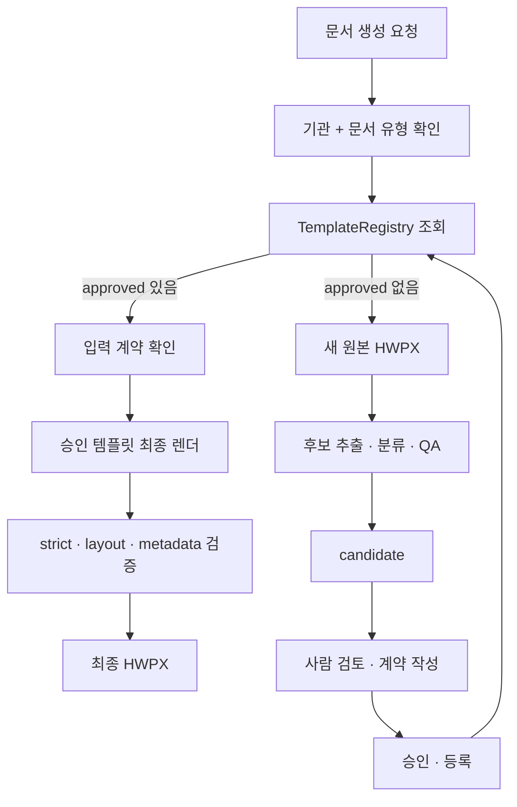

# HWPX 템플릿 생성·렌더링 엔진

기관이 제공한 HWPX 원본의 레이아웃을 보존하면서, 반복적으로 바뀌는 내용만 안전하게 채워 최종 HWPX를 생성하는 참조 기반 템플릿 엔진입니다.

이 저장소는 자유 형식 문서 생성기나 포맷 변환기가 아닙니다. 다루는 경로는 두 가지입니다.

1. 이미 승인된 템플릿으로 최종 문서를 생성한다.
2. 승인 템플릿이 없으면 새 HWPX 원본에서 후보를 추출·QA하고, 사람이 검토한 뒤 등록한다.

---

## 핵심 원칙

- `candidate`와 `approved`는 다릅니다. 자동 추출이나 strict 검증에 성공해도 자동 승인되지 않습니다.
- 최종 문서 생성에는 `approved` 템플릿만 사용합니다.
- 원본 HWPX의 레이아웃과 구조를 최대한 보존하고, 필요한 내용만 치환합니다.
- 표의 행·열 위치 같은 좌표는 렌더 주소이지, 그 자체로 문서 의미를 확정하는 근거가 아닙니다.
- 반복 구간은 자동으로 활성화하지 않습니다. 사람이 승인한 `alias_map.json`의 `blocks` 계약만 반복 렌더링에 사용합니다.
- strict HWPX 검증 통과는 패키지 구조가 유효하다는 뜻이지, 시각적 충실도나 기관 승인을 뜻하지 않습니다.

---

## 요청이 들어왔을 때의 실행 경로



즉, 새 HWPX를 항상 다시 추출하는 것이 아닙니다. 먼저 승인 템플릿이 있는지 확인하고, 있으면 그대로 재사용합니다.

---

## 상태 구분

| 상태 | 의미 | 가능한 작업 | 최종 문서 생성 |
|---|---|---|---|
| `candidate` | 자동 추출·QA 후 사람이 검토해야 하는 템플릿 후보 | field 분류, 별칭, 반복, metadata 계약 검토 | 불가 |
| `approved` | 사람이 계약과 결과를 확인해 등록한 운영 템플릿 | Registry 조회, 입력 검증, 최종 렌더 | 가능 |

현재 사용 가능한 승인 템플릿은 README에 고정 목록으로 관리하지 않습니다. 실제 상태는 `TemplateRegistry` 또는 `core.document_api.list_approved_templates()`를 통해 조회합니다.

---

# 운영 매뉴얼

## 1. 실행 환경 준비

Python 버전은 [.python-version](.python-version)을 따릅니다.

이 저장소는 두 submodule에 의존합니다.

- `templates/institutions/` — 실제 기관 템플릿 데이터
- `skills/hwp-skill/` — 일부 HWPX `table_cell` 치환 처리

Windows PowerShell:

```powershell
git submodule update --init --recursive
python -m venv .venv
.\.venv\Scripts\python.exe -m pip install -r requirements-dev.txt
```

macOS/Linux Bash:

```bash
git submodule update --init --recursive
python3 -m venv .venv
./.venv/bin/python -m pip install -r requirements-dev.txt
```

---

## 2. 승인 템플릿으로 최종 문서 생성

승인 템플릿이 이미 있다면 새 candidate를 만들지 않고 바로 최종 렌더 경로를 사용합니다.

`content.json`:

```json
{
  "template_id": "<승인 템플릿의 template_id>",
  "fields": {
    "<사람용 별칭 또는 field_id>": "<값>"
  }
}
```

Windows PowerShell:

```powershell
.\.venv\Scripts\python.exe scripts/templates/render_hwpx_template.py `
  --institution <기관명> `
  --document-type <문서유형> `
  --content <content.json> `
  --output sandbox/<출력.hwpx> `
  --requester-name <요청자>
```

macOS/Linux Bash:

```bash
./.venv/bin/python scripts/templates/render_hwpx_template.py \
  --institution <기관명> \
  --document-type <문서유형> \
  --content <content.json> \
  --output sandbox/<출력.hwpx> \
  --requester-name <요청자>
```

렌더 결과에서는 최소한 다음을 확인합니다.

- `missing_fields`
- `leftover_placeholders`
- Python API를 직접 쓴 경우 `unknown_keys`

`template_id`가 승인 템플릿과 다르면 렌더를 거부합니다.

---

## 3. 승인 템플릿이 없을 때 candidate 생성

새로운 기관·문서 유형의 HWPX를 템플릿화하려면 후보 생성 경로를 사용합니다.

Windows PowerShell:

```powershell
.\.venv\Scripts\python.exe scripts/templates/qa_hwpx_template.py `
  --source <원본.hwpx> `
  --output-dir sandbox/template-candidates/<새-후보> `
  --institution <기관명> `
  --document-type <문서유형>
```

macOS/Linux Bash:

```bash
./.venv/bin/python scripts/templates/qa_hwpx_template.py \
  --source <원본.hwpx> \
  --output-dir sandbox/template-candidates/<새-후보> \
  --institution <기관명> \
  --document-type <문서유형>
```

후보 생성기는 원본 패키지를 보존하면서 교체 후보와 고정 영역을 분리하고, candidate QA에 필요한 산출물을 만듭니다.

자동 분류 결과만으로 문서 의미가 확정되지는 않습니다. 제목, 라벨, 날짜, 표 셀,
marker, 반복 구간처럼 XML 좌표만으로 의미를 판단하기 어려운 항목은 사람이 검토합니다.

후보 생성 경로는 원본을 보존하면서 사람이 검토할 수 있는 `candidate`를 만드는 데 목적이 있습니다.

---

## 4. candidate 검토

후보 폴더에서는 다음을 확인합니다.

| 파일 | 확인할 내용 |
|---|---|
| `source.hwpx` | 입력 원본 snapshot |
| `template.json` | 기관, 문서 유형, `template_id`, `status: candidate` |
| `placeholder_map.json` | 교체 field와 위치, `replacement_mode`, layout 정보 |
| `template.review.md` | 자동 분류 결과와 사람이 판단해야 할 항목 |
| `content.sample.json`, `content.test.json` | QA용 입력값 |
| `roundtrip.sample.hwpx`, `roundtrip.test.hwpx` | 실제 치환 후 구조·서식 확인 |
| `qa.report.json` | snapshot, field identity, strict 검증 결과 |
| `alias_map.json` | 사람이 정하는 최종 입력 계약 |

후보 경로가 모호한 항목을 별도 검토 대상으로 남기는 경우에는, 해당 항목을 사람이 판단한 뒤 승인된 규칙으로 다시 QA해야 합니다.

### `alias_map.json`의 역할

`alias_map.json`은 단순 별칭 파일이 아니라 최종 렌더의 사람 승인 계약입니다.

주요 항목은 다음과 같습니다.

| 키 | 역할 |
|---|---|
| `fields` / `aliases` | 사람용 이름을 `field_id`에 연결 |
| `title_field` | 문서 제목으로 사용할 field 지정 |
| `choices` | 선택지 입력 규칙 |
| `text_rules` | 문장·문단·접두사·접미사 규칙 |
| `fit_constraints` | 원본 레이아웃을 넘지 않도록 길이 제한 |
| `blocks` | 사람이 승인한 반복 구간 |
| `metadata` | `content.hpf` 문서 속성 생성 계약 |

반복은 구조가 비슷해 보인다는 이유만으로 자동 활성화하지 않습니다. 사람이 `blocks` 계약을 작성한 경우에만 반복 렌더링을 수행합니다.

세부 렌더링·반복·레이아웃 규칙은 아래 **프로젝트 문서**를 참고합니다.

---

## 5. 사람이 승인한 candidate 등록

candidate를 검토하고 실제 운영 템플릿으로 사용하기로 결정한 경우에만 등록합니다.

Windows PowerShell:

```powershell
.\.venv\Scripts\python.exe scripts/templates/register_hwpx_template.py `
  --candidate sandbox/template-candidates/<후보> `
  --approve
```

macOS/Linux Bash:

```bash
./.venv/bin/python scripts/templates/register_hwpx_template.py \
  --candidate sandbox/template-candidates/<후보> \
  --approve
```

`--approve`는 사람의 명시적 승인 의사를 의미합니다.

등록은 candidate를 정식 Registry 경로에 반영하고 `approved` 상태로 전환합니다. Git commit이나 push는 자동으로 수행하지 않습니다.

---

## 6. Python API

CLI 대신 Python 코드에서 사용할 때는 `core.document_api`를 공개 진입점으로 사용합니다.

```python
from datetime import datetime, timezone
from pathlib import Path

from core.adapters.hwpx_template_input import RenderExecutionContext
from core.document_api import (
    get_template_contract,
    list_approved_templates,
    render_approved_document,
    validate_template_content,
)

for candidate in list_approved_templates():
    identity = candidate.identity
    print(identity.institution, identity.document_type, identity.template_id)

placeholder_map, alias_map = get_template_contract("<기관명>", "<문서유형>")

context = RenderExecutionContext(
    requester_name="<요청자>",
    requested_at=datetime.now(timezone.utc),
)

content = {"<사람용 별칭 또는 field_id>": "<값>"}

validate_template_content("<기관명>", "<문서유형>", content, context)

result = render_approved_document(
    "<기관명>",
    "<문서유형>",
    content,
    Path("sandbox/<출력>.hwpx"),
    context,
)
```

공개 API는 다음 네 함수입니다.

- `list_approved_templates()`
- `get_template_contract()`
- `validate_template_content()`
- `render_approved_document()`

렌더러 내부 구현을 직접 호출하는 대신 이 API를 연결 경계로 사용합니다.

---

## 7. 저장소 검증

Windows PowerShell:

```powershell
.\.venv\Scripts\python.exe -m pytest tests/ -q --basetemp=sandbox/pytest
```

macOS/Linux Bash:

```bash
./.venv/bin/python -m pytest tests/ -q --basetemp=sandbox/pytest
```

관련 테스트가 실패하거나 경고하면 완료·검증됨으로 간주하지 않습니다.

---

## 저장소 경계

- 공개 저장소: 엔진 코드, CLI, 테스트, 검증 정책
- `templates/institutions/`: 실제 기관 템플릿 데이터 submodule
- `skills/hwp-skill/`: 일부 HWPX 치환 기능 submodule
- `sandbox/`: candidate QA, pytest, 임시 출력물
- `docs/`: 장기 유지할 아키텍처·정책 문서

일반 DOCX/PPTX/PDF export, 자유 형식 공문 생성, 일반 `md2hwpx` 변환은 이 저장소의 범위가 아닙니다.

런타임 Python 의존성은 `requirements.txt`의 `python-hwpx`, `lxml`, `fonttools`입니다.

---

## 프로젝트 문서

이 README는 아래 저장소 내부 계약을 요약합니다.

- `AGENTS.md` — 프로젝트 목표, 금지사항, 테스트·문서 정책
- `SKILL.md` — 승인 템플릿 조회 → 최종 렌더 / candidate QA 라우팅
- `docs/agent-policies/hwpx-template-rendering.md` — HWPX 템플릿 라우팅과 반복 계약
- `docs/agent-policies/hwpx-render-pipeline-diagram.md` — 실제 렌더·QA 파이프라인
- `docs/agent-policies/hwpx-layout-context.md` — 레이아웃 보존 계약

상세 스키마와 구현 규칙은 위 정책 문서를 기준으로 유지합니다.

---

## 외부 출처 및 참고 자료

### 오픈소스

- **[hwpx-skill](https://github.com/jkf87/hwpx-skill)**  
  HWP/HWPX 문서 처리 기능을 제공하는 오픈소스 프로젝트로, 이 저장소의
  `skills/hwp-skill/`과 관련된 기반 프로젝트입니다. MIT License.

- **python-hwpx**  
  HWPX 패키지 처리와 strict package validation에 사용하는 Python 라이브러리입니다.

각 오픈소스의 저작권과 라이선스는 원저작자 및 해당 프로젝트에 귀속됩니다.

### 예시 HWPX 자료 — 범정부오피스

범정부오피스는 이 프로젝트의 오픈소스 기반 코드가 아닙니다.

범정부오피스 관련 HWPX 문서는 사용자가 새로운 HWPX 파일을 제공하는 상황을 재현하여
**신규 템플릿 후보 추출·레이아웃 보존·candidate QA 파이프라인을 검증하기 위한
예시 입력 문서**로 활용했습니다.

관련 출처는 성격에 따라 다음과 같이 구분합니다.

- **행정안전부 공식 게시물** — 범정부오피스 프로그램 및 공개 자료의 공식 출처
- **이경수 주무관 관련 언론 보도** — 개발 배경과 개발자 관련 공개 정보의 보조 출처
- **온나라 커뮤니티** — 범정부오피스 관련 자료의 공공부문 내부 배포 경로

범정부오피스의 문서 형식·문구·업무 규칙을 이 프로젝트의 범용 규칙으로 사용하거나,
해당 프로그램의 코드 또는 내부 구현을 이 프로젝트에 포함한 것은 아닙니다.
