# HWPX 렌더링·QA 파이프라인 다이어그램

이 문서는 승인 템플릿 최종 렌더링과 후보 템플릿 QA 왕복이 어떻게 입력 해석과
렌더·검증 커널을 공유하는지 보여주는 Mermaid 다이어그램을 보관한다. 정책 원문은
[HWPX template routing rules](hwpx-template-rendering.md)이고, 레이아웃 보존
계약의 세부 설계는 [HWPX 레이아웃 보존 계약 (설계)](hwpx-layout-context.md)이다.
이 다이어그램은 그 둘의 관계를 한눈에 보여주는 보조 자료다.

## 검증 상태

2026-08-10에 아래 소스와 한 줄씩 대조하여 정확성을 확인했다. 이후 파이프라인이
바뀌면 이 다이어그램은 자동으로 갱신되지 않으므로, 관련 코드를 바꿀 때 함께
갱신하거나 최소한 정확성을 재확인해야 한다.

- `core/adapters/hwpx_template_input.py` — `resolve_hwpx_template_input()`,
  `prepare_hwpx_template_input()`, `_resolve_metadata()`
- `core/adapters/hwpx_template_renderer.py` — `render_candidate_roundtrip()`,
  `orchestrate_hwpx_render()`, `render_prepared_hwpx_template()`,
  `_render_filled_package()`
- `core/adapters/hwpx_alias_map.py` — `flatten_content()`, `resolve_flattened()`
- `core/templates/registry.py` — `TemplateRegistry.find()`
- `scripts/templates/qa_hwpx_template.py`

## 다이어그램

```mermaid
flowchart LR
    subgraph ENTRY["① 진입과 템플릿 상태"]
        FINAL["최종 생성 요청<br/>CLI · document_api · compose"]
        QA["후보 제작·QA<br/>qa_hwpx_template.py"]
        CONTEXT["RenderExecutionContext<br/>요청자·UTC 요청 시각"]

        PRODREG["운영 Registry<br/>approved만 조회"]
        QAREG["QA Registry<br/>TemplateRegistry(ROOT / templates/institutions)<br/>기존 계약과 field identity 비교"]

        DIRECTOR["원장보고<br/>approved"]
        ONEPAGE["원페이지<br/>candidate<br/>alias·metadata 계약은 존재"]

        FINAL --> PRODREG
        QA --> QAREG
        DIRECTOR --> PRODREG
        ONEPAGE -. 운영 조회 불가 .-> PRODREG
        CONTEXT --> FINAL
    end

    subgraph ASSET["② 공통 템플릿 자산"]
        SOURCE["source.hwpx<br/>완전한 원본 패키지"]
        TEMPLATE["template/section*.template.xml<br/>고정 구조와 placeholder"]
        PMAP["placeholder_map.json<br/>field 위치·replacement_mode"]
        LAYOUT["layout-context-v1<br/>paraPr·header margin·cell margin<br/>leading/trailing fwSpace<br/>section_paragraph_counts"]
        ADDRESS["table_cell 물리 주소<br/>section_index·table·row·col"]
        ALIAS["alias_map.json<br/>사람용 이름·choice·text_rules<br/>반복 블록·metadata 선언"]

        PMAP --> LAYOUT
        PMAP --> ADDRESS
    end

    subgraph PREPARE["③ 두 경로가 공유하는 입력 해석"]
        FINALWRAP["orchestrate_hwpx_render()<br/>최종 생성"]
        QAWRAP["render_candidate_roundtrip()<br/>resolve_metadata=False"]

        RESOLVE["resolve_hwpx_template_input()<br/>placeholder_map·alias_map 조회"]
        HASALIAS{"alias_map 있음?"}
        FLATTEN["flatten_content()<br/>입력을 한 번만 순회"]
        RULES["resolve_flattened()<br/>choice·text_rules 적용<br/>field_id로 변환"]
        PASSTHROUGH["field_id 입력 그대로 사용<br/>fresh candidate의 alias_map 부재 경로"]
        PLAN["ResolvedRenderPlan<br/>일반 field·반복값·fit 계약"]

        META["_resolve_metadata()<br/>최종 생성에서만 실행<br/>같은 flattened 값 사용"]
        PREPARED["PreparedRenderContent<br/>RenderPlan + package_metadata"]
        FINALRENDER["render_prepared_hwpx_template()"]

        FINAL --> FINALWRAP --> RESOLVE
        QA --> QAWRAP --> RESOLVE
        ALIAS --> RESOLVE
        PMAP --> RESOLVE

        RESOLVE --> HASALIAS
        HASALIAS -- 예 --> FLATTEN --> RULES --> PLAN
        HASALIAS -- 아니오 --> PASSTHROUGH --> PLAN

        FLATTEN -- 최종 생성이고 metadata 계약 있음 --> META
        META --> PREPARED
        CONTEXT --> PREPARED
        PLAN -- 최종 생성 --> PREPARED
        PREPARED --> FINALRENDER

        PLAN -- 후보 QA: metadata 없음 --> KERNEL
        FINALRENDER --> KERNEL
    end

    subgraph KERNELBOX["④ 완전히 공용인 렌더·검증 커널"]
        KERNEL["_render_filled_package()"]

        TABLEPLAN["table_cell 입력 계획 계산<br/>_table_cell_fills()"]
        FILL["section 렌더링<br/>fit 검사·반복 전개·hp:t 치환<br/>변경 section의 linesegarray 제거"]

        WRITE["_write_hwpx_package()<br/>source.hwpx 기반 출력 파일 생성<br/>section 기록·namespace 복원"]
        HPF{"package_metadata 있음?"}
        HPF9["WRITE 내부에서<br/>content.hpf 9개 갱신"]
        HPFKEEP["content.hpf 원본 유지"]

        TABLE{"table_cell 입력 있음?"}
        HWP["출력 HWPX를 hwp-skill에 전달<br/>table cell 치환"]
        FWSPACE["필요한 leading fwSpace 복원"]

        LAYOUTCHECK["_validate_rendered_layout()<br/>verify_recorded_layout()"]
        PREVIEW{"package_metadata 있음?"}
        PRVTEXT["_refresh_fss_preview_text()<br/>PrvText.txt 재생성"]
        STRICT["validate_hwpx_output()<br/>strict HWPX validation"]
        RESULT["생성 결과"]

        KERNEL --> TABLEPLAN --> FILL --> WRITE

        WRITE --> HPF
        HPF -- 예 --> HPF9 --> TABLE
        HPF -- 아니오 --> HPFKEEP --> TABLE

        TABLE -- 예 --> HWP --> FWSPACE --> LAYOUTCHECK
        TABLE -- 아니오 --> LAYOUTCHECK

        LAYOUTCHECK --> PREVIEW
        PREVIEW -- 최종 생성 --> PRVTEXT --> STRICT
        PREVIEW -- 후보 QA --> STRICT
        STRICT --> RESULT
    end

    SOURCE --> WRITE
    TEMPLATE --> FILL
    PMAP --> TABLEPLAN
    LAYOUT --> LAYOUTCHECK
    ADDRESS --> TABLEPLAN
```

